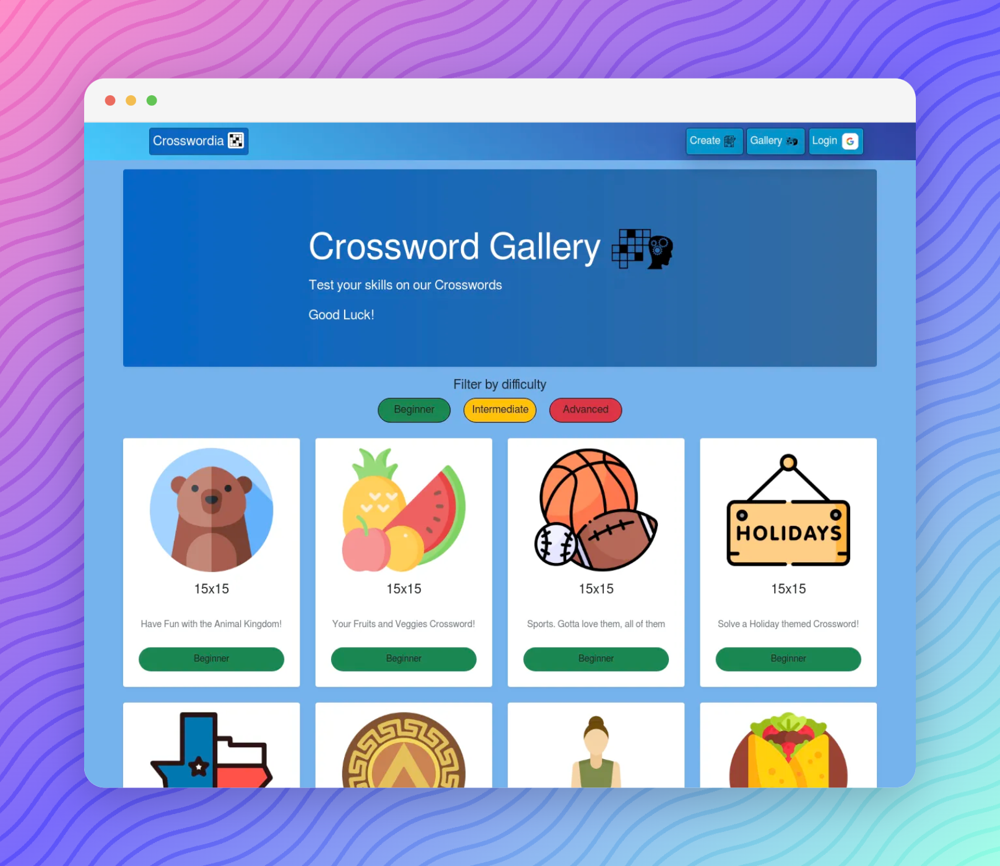

<p align="center">
  
</p>

<h1 align="center">Crosswordia</h1>
<p align="center">
  Create, solve and share crosswords with your friends!
</p>

## Getting Started

This project uses [pnpm](https://pnpm.io/) as its package manager. Install dependencies with:

```bash
pnpm install
```

Then run the dev server:

```bash
pnpm dev
```
